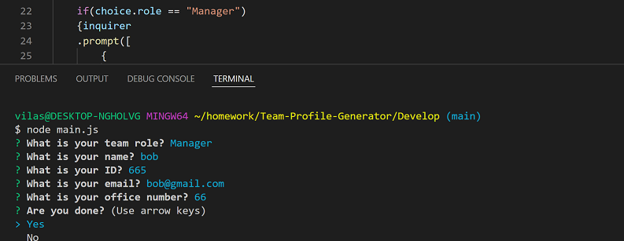

# Team Profile Generator

## Description

This is a node app that will take user inputs about team members and their information and generate an HTML page with that information

## Features

Uses inquirer to ask the user questions about their team members.
Creates HTML page for the team with individual cards for each member and their information

## Installation

Run NPM install to install inquirer and any required modules

## Links

<a href="https://vilas-izquierdo.github.io/Team-Profile-Generator/">Deployed Page</a>

<a href="https://github.com/vilas-izquierdo/Team-Profile-Generator">GitHub</a>